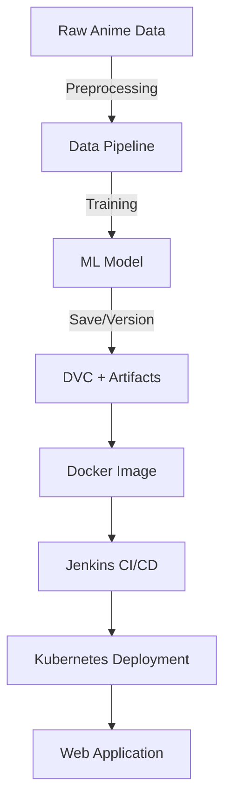

# ML\_ops\_anime 🎌

A **machine learning-powered anime recommendation system** that leverages collaborative filtering with TensorFlow/Keras. This project integrates **MLOps best practices** such as Docker, Jenkins, and Kubernetes for reproducible, scalable deployment.

The goal is to deliver **personalized anime recommendations** based on user preferences and historical viewing data.

---


## 🚀 Features

* **Data Preprocessing** – Cleans and prepares anime ratings datasets.
* **Model Training** – Embedding layers with TensorFlow/Keras for collaborative filtering.
* **Recommendation Engine** – Suggests anime titles tailored to users.
* **MLOps Integration** – Uses Docker, Jenkins, DVC, and Kubernetes for automation, versioning, and deployment.
* **Web Application** – Simple interface to interact with the recommendation system.

---

## 🖼️ Architecture Overview



---

## 📂 Project Structure

```
ML_ops_anime/
├── .dvc/                # DVC tracking for datasets and models
├── ML_OPS_ANIME.egg-info/
├── artifacts/           # Tracked artifacts (raw_data, models)
├── config/              # Configuration files
├── custom_jenkins/      # Jenkins CI/CD scripts
├── notebooks/           # Jupyter notebooks for experiments
├── pipeline/            # ML pipeline code
├── src/                 # Core source code for model and training
├── static/              # Static web assets (CSS, JS, images)
├── templates/           # Web templates (HTML)
├── utils/               # Utility scripts
├── .dvcignore           # DVC ignore rules
├── .gitignore           # Git ignore rules
├── Dockerfile           # Docker image definition
├── Jenkinsfile          # CI/CD pipeline definition
├── application.py       # Flask/FastAPI app entry point
├── deployment.yml       # Kubernetes deployment configuration
├── requirements.txt     # Python dependencies
└── setup.py             # Package setup
```

---

## ⚙️ Installation & Usage

```bash
# Clone repo
git clone https://github.com/cmorris2945/ML_ops_anime.git
cd ML_ops_anime

# Install dependencies
pip install -r requirements.txt

# Run locally
python application.py
```

For containerized deployment:

```bash
docker build -t ml_ops_anime .
docker run -p 5000:5000 ml_ops_anime
```

---

## 🌐 Deployment

* **Local**: Flask/FastAPI app runs at `http://localhost:5000`
* **CI/CD**: Automated with **Jenkins** + **Docker**
* **Production**: Kubernetes-managed deployment with scaling support

---

## 📊 Tech Stack

* **ML**: TensorFlow, Keras
* **MLOps**: Docker, Jenkins, DVC, Kubernetes
* **Backend**: Python (Flask/FastAPI)
* **Frontend**: HTML/CSS (basic interface)

---

## 🤝 Contributions

Pull requests and suggestions are welcome. Please open an issue first to discuss changes.

---

## 📜 License

This project is licensed under the MIT License.
